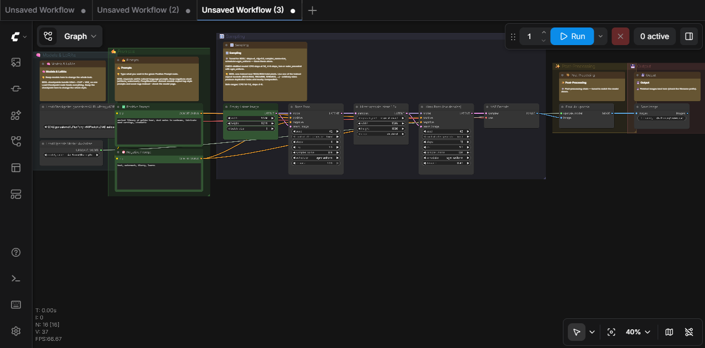
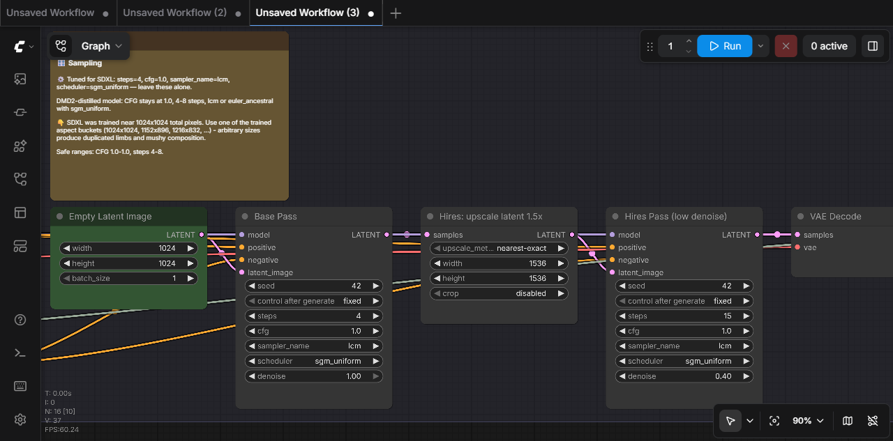

# comfy-draftsman

**The MCP server that drafts ComfyUI workflows a human can actually read.**

A local-first [Model Context Protocol](https://modelcontextprotocol.io) server that lets coding agents (Claude Code, Claude Desktop, Cursor, ...) build, repair, port, validate, and run ComfyUI workflows against **your own ComfyUI instance** — and deliver them as clean, organized, fully-labeled workflows: computed layout, colored stage groups, titled nodes, green-highlighted "knobs you may touch", and markdown guidance notes explaining which tuned settings to leave alone and why.



Every agent tool for ComfyUI can emit raw API-format JSON — a working but unreadable pile of unpositioned nodes. Draftsman's reason to exist is the finished drawing:



*The note above was generated automatically: draftsman detected the checkpoint was a DMD-distilled SDXL merge and tuned CFG to 1.0, 4 steps, lcm/sgm_uniform — then wrote down why, so the person opening the workflow doesn't "fix" it back to CFG 7.*

## What it does

- **Draft** — seed from ComfyUI's bundled templates (always current with the latest models) or build from scratch with semantic graph operations (`add_node`, `connect`, `set_widget` — validated against the live instance's schemas).
- **Organize** — the differentiator: pipeline-stage auto-layout, colored groups, human titles (`✅ Positive Prompt`, `Base Pass`), green highlights on user-editable knobs, and generated notes in two registers: *"👇 type your prompt here"* vs *"⚙️ turbo model — CFG stays at 1.0"*.
- **Diagnose & modernize** — hand it an old broken workflow: it reports every incompatibility against your live instance (renamed nodes, changed widget layouts, missing model files with closest-installed suggestions) and resolves missing custom nodes to installable packs via the official Comfy Registry.
- **Port** — retarget across model families (`sdxl` → `flux`, ...): swaps loader topology (checkpoint ⇄ separate UNET/CLIP/VAE loaders) and rewires consumers, retunes CFG/steps/samplers *and* technique nodes (FaceDetailer settings are family-specific — there is no universal detailer config), swaps latent node classes, picks installed model files, and flags everything needing human judgment.
- **Validate & prove** — structural + live validation, then an actual render with a returned preview image, before the workflow is ever delivered.
- **Learn** — a two-layer knowledge system: a curated per-family floor (SD1.5/SDXL/SD3.5/FLUX/Chroma/Qwen-Image/Wan/LTX, variant-aware for turbo/lightning/DMD/distills) plus a **persistent learned overlay**: when the agent researches better settings for a new model, `record_learning` saves them so every future session starts smarter.
- **Stay current** — ground truth is your running ComfyUI (`/object_info`, live templates, live model lists), never a bundled snapshot.

## Requirements

- Python ≥ 3.11 with [uv](https://docs.astral.sh/uv/) (or pip)
- A running ComfyUI instance (default `http://127.0.0.1:8188`)

## Install

**Claude Code:**

```bash
claude mcp add comfy-draftsman -e COMFYUI_URL=http://127.0.0.1:8188 -- uvx --from git+https://github.com/EnragedAntelope/comfy-draftsman comfy-draftsman
```

**Claude Desktop / other MCP clients** (`mcpServers` config):

```json
{
  "mcpServers": {
    "comfy-draftsman": {
      "command": "uvx",
      "args": ["--from", "git+https://github.com/EnragedAntelope/comfy-draftsman", "comfy-draftsman"],
      "env": { "COMFYUI_URL": "http://127.0.0.1:8188" }
    }
  }
}
```

Then just ask your agent things like:

> *"Build me a Krea workflow with LoRA support and a face detailer, labeled so my friend can use it."*
>
> *"Here's an old SD1.5 workflow JSON that doesn't load anymore — fix it and port it to SDXL."*
>
> *"Take this workflow I downloaded and make it neat and organized."*

### Configuration

| Env var | Default | Purpose |
|---|---|---|
| `COMFYUI_URL` | `http://127.0.0.1:8188` | The ComfyUI instance to drive |
| `DRAFTSMAN_SESSION_DIR` | `./.draftsman-sessions` | Where in-progress workflows persist |
| `DRAFTSMAN_LEARNED_DIR` | `~/.comfy-draftsman/learned` | Persistent learned model knowledge |
| `DRAFTSMAN_TIMEOUT` | `30` | HTTP timeout (seconds) |

## Tools

**Discovery** — `get_instance_info`, `search_nodes`, `get_node_info`, `list_models`, `list_templates`

**Authoring** — `create_workflow` (blank or template-seeded), `import_workflow` (UI or API format), `inspect_workflow`, `edit_workflow` (batched ops), `organize_workflow`, `lint_workflow`

**Correctness** — `validate_workflow` (live checks + closest-match suggestions), `diagnose_workflow` (validation + registry resolution of missing nodes), `port_workflow`

**Execution & delivery** — `run_workflow` (render + preview image), `save_workflow` (lands in ComfyUI's workflow browser), `export_workflow_json`

**Ecosystem & knowledge** — `resolve_missing_nodes`, `search_node_packs`, `get_model_guidance`, `record_learning`

**Prompts** — `build_workflow`, `modernize_workflow` (guided flows) · **Resources** — `draftsman://workflow-format`, `draftsman://knowledge/{family}`

## How it stays correct

- The graph model round-trips ComfyUI's UI workflow format (schema 0.4) faithfully and serializes to API format with the fiddly bits handled: positional widget arrays (including `control_after_generate` slots), converted-widget connections, PrimitiveNode baking, Reroute tracing, mute/bypass semantics.
- Everything is validated against the **live** `/object_info` — combo checks double as "is this model actually installed" checks.
- The test suite includes protocol-level end-to-end tests that build, validate, organize, **render**, and save real workflows on a real ComfyUI instance.

## Security notes

- Runs over stdio only; the server opens no listening port.
- Talks only to the ComfyUI URL you configure and (read-only) the official Comfy Registry at `api.comfy.org`.
- It never installs custom nodes. `resolve_missing_nodes` tells you *which* pack provides a missing node and how to install it yourself — custom node packs execute arbitrary code, so that decision stays with you.

## Development

```bash
git clone https://github.com/EnragedAntelope/comfy-draftsman
cd comfy-draftsman
uv sync --group dev
uv run pytest                 # unit tests (no ComfyUI needed)
uv run pytest -m integration  # needs a live instance: COMFYUI_TEST_URL=http://127.0.0.1:8288
uv run ruff check .
```

The repo's `.comfyui-test/` convention (gitignored) holds a disposable ComfyUI clone for integration testing — see `tests/test_integration_live.py`.

## Related projects

- [artokun/comfyui-mcp](https://github.com/artokun/comfyui-mcp) — a broad local control plane for ComfyUI (108 tools: model management, node management, process control). Draftsman is deliberately narrow and complementary: its output artifact is the organized, annotated workflow. Run both if you want breadth + finish.
- [Comfy Cloud MCP](https://docs.comfy.org/development/cloud/mcp-server) — the official server; cloud-only.

## License

MIT
